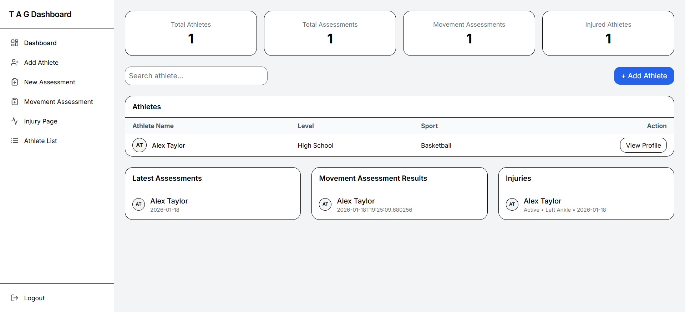
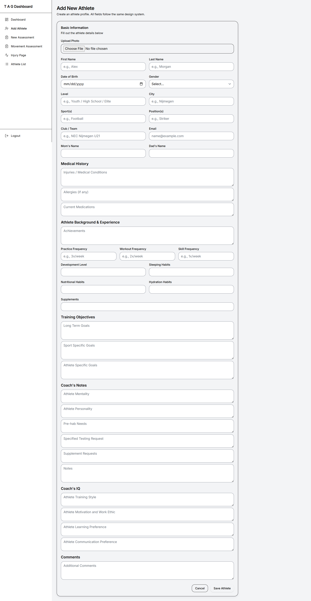
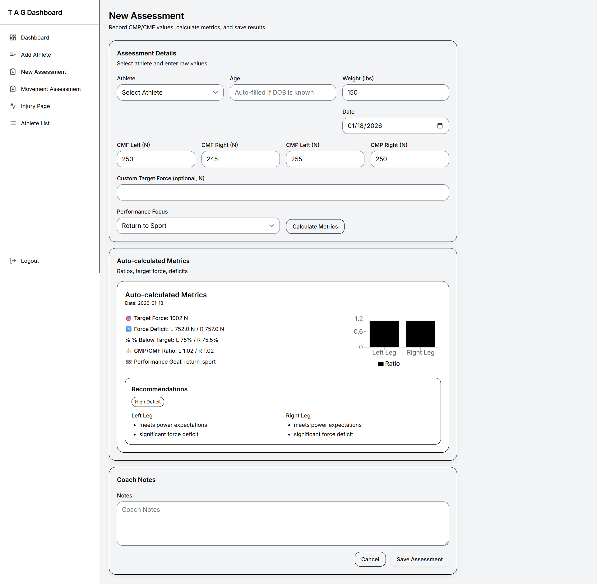
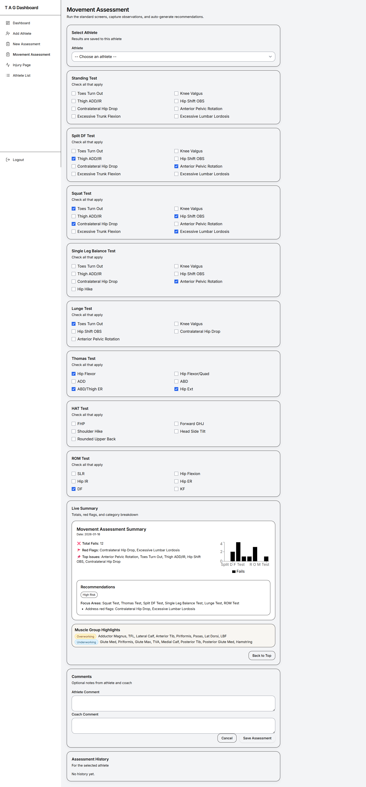
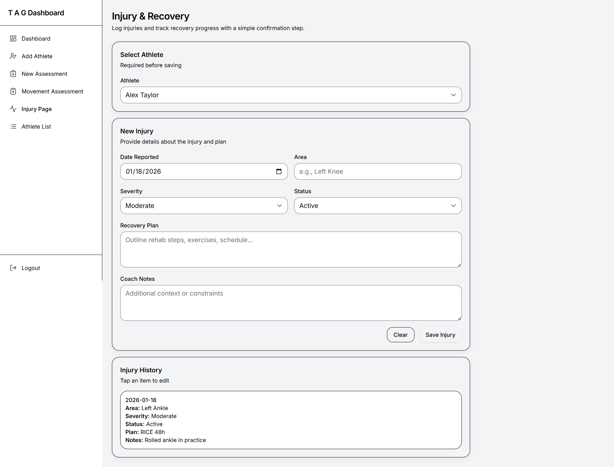

# TAG Dashboard — Athlete Performance & Training Analytics

TAG Dashboard is a full-stack web application designed to help coaches and practitioners **analyze athlete performance**, **track progress over time**, and **translate assessments into structured training insights**.

## Screenshots

### Dashboard Overview
Centralized view of athletes, assessments, injuries, and recent activity.


### Add New Athlete
Comprehensive athlete profile creation including background, medical history, and training goals.


### Performance Assessment & Metrics
Assessment input with auto-calculated metrics, ratios, deficits, and recommendations.


### Movement Assessment
Structured movement screening with live summaries, risk flags, and focus areas.


### Injury & Recovery Tracking
Log injuries, monitor recovery status, and maintain longitudinal injury history.



The system provides a centralized, practical dashboard for managing athletes, recording assessments, visualizing progress, and maintaining long-term performance records.

---

## 🎯 Project Motivation

In many training environments, athlete data is fragmented across spreadsheets, notes, or disconnected tools. This makes it difficult to:

- Monitor progress consistently
- Compare assessments over time
- Turn measurements into actionable coaching decisions

TAG Dashboard was built to solve this problem by offering a **clean, structured, and locally runnable system** that supports real coaching workflows without unnecessary complexity or hosting costs.

---

## 🚀 Core Features

- Athlete profile management (including photos)
- Physical assessments with visual summaries
- Movement screens with live summaries and confirmation
- Injury tracking and history
- Coach notes and longitudinal records
- Profile roll-ups for quick performance overview
- Safe athlete deletion with cascading cleanup

---

## 🧠 Design Philosophy

- **Human-centered dashboards** — built for coaches, not just data collection  
- **Clarity over noise** — visualizations that support decisions  
- **Local-first deployment** — avoids unnecessary cloud costs  
- **Extensible structure** — new metrics and assessments can be added easily  

---

## 🛠️ Tech Stack

### Frontend
- React (Vite)
- Tailwind CSS
- shadcn/ui
- Component-based dashboard architecture

### Backend
- FastAPI
- Python
- SQLAlchemy
- RESTful API design
- Local file uploads (`/uploads`)

---

## 🖥️ Deployment & Execution

The application was initially deployed on an **Ubuntu server**, but later adapted to run **locally** to better match the project’s scale and reduce operational costs.

The system runs fully offline and does not require cloud infrastructure.

---

## ⚙️ Local Setup

### What This Includes
- Backend: FastAPI + SQLAlchemy
- Frontend: React (Vite) + Tailwind
- Uploads folder mounted at `/uploads`
- Cross-platform startup scripts

---

### Quick Start (Windows)

#### One-click setup
1. Open the repository folder  
2. Right-click  
   `scripts/windows_setup_and_run.ps1` → **Run with PowerShell**  

If blocked:
```powershell
powershell -ExecutionPolicy Bypass -File .\scripts\windows_setup_and_run.ps1
